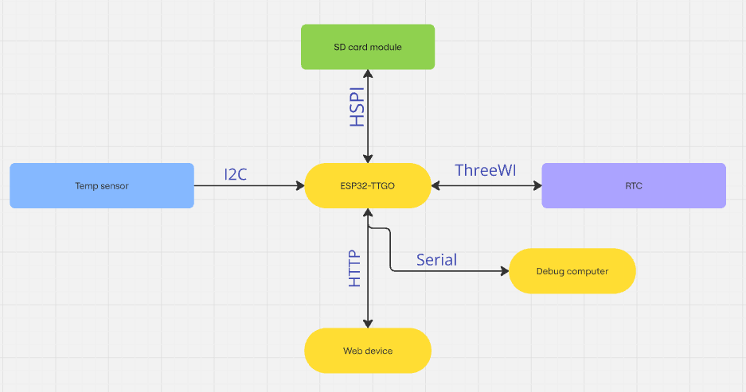
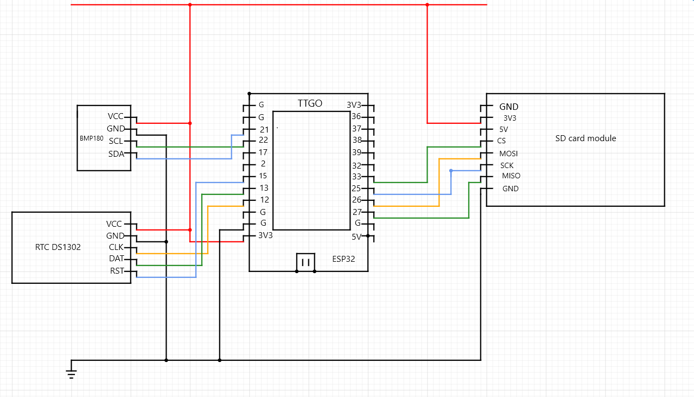
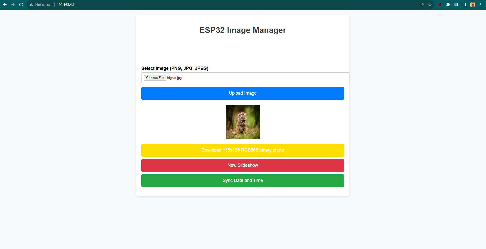

    Introducere:
Ideea de proiect: O rama 'foto' digitala, care afiseaza si data si temperatura interioara.
Scopul: slideshow poze memorabile si afisare date utile.
Ideea: Am avut un ceas smart, mi s-a stricat si ii duc lipsa. Ideea initiala folosea Bluetooth si Wifi, dar in timpul implementarii au aparut probleme asa ca am reinventat putin ideea.
Utilitate: ease of access, amintiri (poze incarcate).

    Descriere generala:
        Initializare: Microcontroller-ul foloseste interfata seriala pentru mesaje de debug, I2C/TWI pentru senzorul de temperatura, ThreeWI pentru RTC si SPI pentru SD card. Intern, placa are un SPI separat pentru display. 
            MC-ul initializeaza toate componentele si porneste o retea Wi-Fi pe care o va folosi pentru a comunica cu un terminal (PC/telefon smart/orice alt dispozitiv cu capacitati IP). 
        Toata interfata cu MC-ul se face prin Acess Point-ul deschis.    

    Schema bloc:

    Hardware design:
        Schema electrică:

        Lista piese:
    - 1x Placuta ESP32 Wi-Fi, Display integrat
    - 1x SD card module
    - 1x senzor temperatura
    - 1x RTC pentru a pastra timpul chiar daca placuta pierde alimentarea
    - fire de legătură
    - 1x card SD
    - 1x Baterie CR2032

    Software design:
        Display-ul este impartit in doua parti: partea de sus, 135px x 135px si cea de jos, 105px x 135px.
        Partea de sus arata imaginile, iar partea de jos arata informatiile (data, ora, ziua saptamanii, temperatura interioara).

        Initial am incercat sa stochez pe placa imaginile si sa le convertesc in RGB565 direct la afisare, dar nici memoria, nici viteza microprocesorului nu fac fata pentru o interactiune consistenta.

        Microcontroller-ul este server HTTP si raspunde cererilor in reteaua locala, pe IP-ul 192.168.4.1 unde se afla si interfata grafica.

        Partea de procesare a imaginii inainte de RGB565 este facuta in frontend-ul server-ului web, astfel incat placa primeste direct ce trebuie sa afiseze si stocheaza pe cardul SD pentru a nu pierde informatia la urmatorul reboot.

        Informatiile despre timp sunt sincronizate prin HTTP si stocate in modulul RTC, iar temperatura este masurata periodic.

        Cele doua parti ale ecranului sunt independente, informatiile se actualizeaza la secunda, iar slideshow-ul avanseaza dupa 5 secunde.

    Rezultate obtinute:
-
    
    

    Probleme intampinate:
        - WiFi si Bluetooth folosesc prea multa memorie pentru a fi folosite simultan
        - Display-urile cu interfata paralela folosesc mult prea multi pini
        - Incompatibilitati intre versiunea placii si librarii prea noi
        - Stack overflow (cu si fara crash-uri, din cauza imaginilor prea mari)
        - Contacte proaste
        - Soldering

    Concluzii:
-
    - Un proiect mult mai greu decat m-am gandit initial ca va fi, la un moment dat am crezut ca decid sa renunt.
    - Embedded consuma foarte mult timp si atentie
    - Dependentele librariilor in embedded sunt mai rele decat in software dev (nu credeam ca se poate mai rau)

    Jurnal:
        - deadline 1 - ideea si o schema bloc preliminara \
        - deadline 2 - actualizare componente si descriere \
        - deadline 3 - Memorie depasita. Ideea unui ecran mai mare, extern a picat. Am renuntat la ideea de a conecta prin bluetooth si am folosit WiFi si HTTP (o schimbare foarte buna, privind retrospectiv).
-
    Bibliografie/Resurse:
    -   circuit-diagram.org
    -   docs.arduino.cc
    -   github.com/Xinyuan-LilyGO/TTGO-T-Display (github-ul placii)
